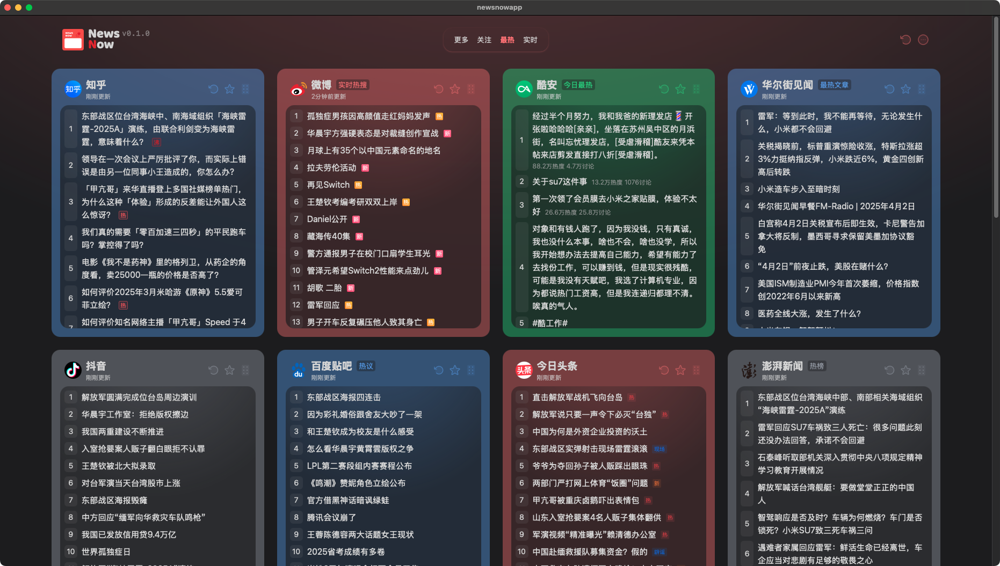

# NewsNow
<a href="https://hellogithub.com/repository/c2978695e74a423189e9ca2543ab3b36" target="_blank"></a>




[English](README.md) | [简体中文](README.zh-CN.md) | 日本語

> [!NOTE]
> このプロジェクトはデモであり、中国語のみをサポートしています。正式版は後日リリースされ、より良いカスタマイズとより多くの英語コンテンツが追加される予定です。

***リアルタイムで最もホットなニュースをエレガントに読む***

## 特徴
- エレガントなデザインで、最新かつ最もホットなニュースを常に把握できる、快適な読書体験を提供します。
- Githubログインとデータ同期をサポート。
- デフォルトのキャッシュ期間は30分です。ログインユーザーは最新データを強制的に取得できます。ただし、リソースを節約し、頻繁なスクレイピングによるIP禁止を防ぐために、コンテンツソースの更新頻度に基づいてスクレイピング間隔が調整されます（最速で2分ごと）。

## デプロイ

ログインとキャッシュが不要な場合は、Cloudflare PagesやVercelなどのプラットフォームに直接デプロイできます。リポジトリをフォークして、対応するプラットフォームにインポートするだけです。

Cloudflare Pagesの場合、ビルドコマンドを`pnpm run build`に設定し、ビルド出力ディレクトリを`dist/output/public`に設定する必要があります。

ログインにはGitHub OAuthが関係しますが、[GitHub Appを作成](https://github.com/settings/applications/new)するだけで特別な権限は必要ありません。コールバックURLは`https://your-domain.com/api/oauth/github`（`your-domain`を実際のドメインに置き換えてください）です。

アプリを作成すると、クライアントIDとクライアントシークレットが取得できます。環境変数の設定場所はプラットフォームによって異なりますが、`example.env.server`ファイルを参照してください。ローカルで実行する場合は、ファイル名を`.env.server`に変更し、必要な値を追加します。

```env
# Github クライアントID
G_CLIENT_ID=
# Github クライアントシークレット
G_CLIENT_SECRET=
# JWTシークレット、通常はクライアントシークレットと同じ
JWT_SECRET=
# データベースの初期化、初回実行時にtrueに設定し、その後はオフにできます
INIT_TABLE=true
# キャッシュを有効にするかどうか
ENABLE_CACHE=true
```

このプロジェクトは主にCloudflare PagesとDockerでのデプロイをサポートしています。Vercelの場合は独自のデータベースを設定する必要があります。サポートされているデータベースはhttps://db0.unjs.io/connectorsで確認できます。

Cloudflare D1データベースは無料で使用できます。Cloudflare Workerのコントロールパネルで手動でD1データベースを作成し、`database_id`と`database_name`を`wrangler.toml`ファイルの対応するフィールドに追加します。

`wrangler.toml`ファイルがない場合は、`example.wrangler.toml`を`wrangler.toml`にリネームし、設定を変更して次回のデプロイ時に反映させます。

Dockerでのデプロイの場合、プロジェクトのルートディレクトリにある`docker-compose.yml`ファイルを使用して、以下のコマンドを実行します。

```sh
docker compose up
```

## 開発

> [!TIP]
> Nodeバージョン >= 20

```sh
corepack enable
pnpm i
pnpm dev
```

データソースを追加したい場合は、`shared/sources`および`server/sources`ディレクトリを参照してください。プロジェクトは完全な型定義とシンプルな構造を持っているので、自由に探索してください。

## ライセンス

[MIT](./LICENSE) © ourongxing
