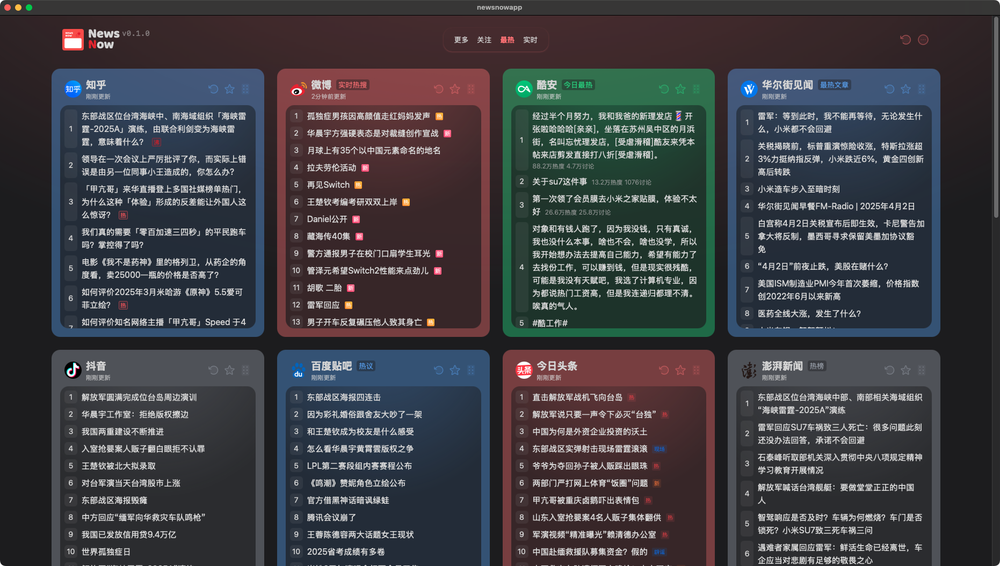
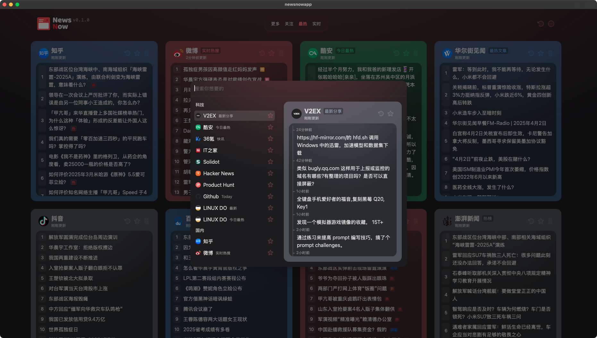

# NewsNow

<a href="https://hellogithub.com/repository/c2978695e74a423189e9ca2543ab3b36" target="_blank"></a>





English | [简体中文](README.zh-CN.md)

> [!NOTE]
> This project is a demo and currently supports only Chinese. A formal version with enhanced customization and more English content will be released later.

***Elegant reading of real-time and hottest news***

## Features
- **Elegant UI**: Provides a clean and user-friendly design for an optimal reading experience.
- **Real-Time Updates**: Keeps users up-to-date with the latest and trending news.
- **GitHub Authentication**: Supports GitHub login and data synchronization.
- **Efficient Caching**: The default cache duration is 30 minutes. Logged-in users can manually refresh data.
- **Intelligent Scraping**: The scraping interval adapts to the update frequency of sources (as frequent as every two minutes) to optimize resource usage and prevent IP bans.

## Deployment

If login and caching are not required, you can directly deploy the project on platforms like **Cloudflare Pages** or **Vercel**. Simply fork the repository and import it into the respective platform.

### **Deploying on Cloudflare Pages**
- Set the build command to `pnpm run build`.
- Set the build output directory to `dist/output/public`.

### **Enabling GitHub Login**
For GitHub OAuth authentication, follow these steps:
1. [Create a GitHub App](https://github.com/settings/applications/new).
2. No special permissions are required.
3. Set the callback URL to `https://your-domain.com/api/oauth/github` (replace `your-domain` with your actual domain).
4. Obtain the Client ID and Client Secret from GitHub.
5. Configure the following environment variables (refer to `example.env.server`):

```env
# Github Client ID
G_CLIENT_ID=
# Github Client Secret
G_CLIENT_SECRET=
# JWT Secret (typically the same as Client Secret)
JWT_SECRET=
# Initialize database (set to true on first run, then turn off)
INIT_TABLE=true
# Enable caching
ENABLE_CACHE=true
```

### **Database Configuration**
- The project supports **Cloudflare D1** (free) and **other databases**.
- To use Cloudflare D1, create a database via the Cloudflare Worker control panel and update your `wrangler.toml` file with `database_id` and `database_name`.
- If `wrangler.toml` is missing, rename `example.wrangler.toml` and configure it accordingly.
- For Vercel deployment, an external database is required. Supported databases can be found at [https://db0.unjs.io/connectors](https://db0.unjs.io/connectors).

### **Docker Deployment**
If you prefer Docker, deploy using:
```sh
docker compose up
```

## Development

> [!TIP]
> Ensure Node.js version >= 20

```sh
corepack enable
pnpm i
pnpm dev
```

To add new data sources, explore the `shared/sources` and `server/sources` directories. The project has a well-structured codebase with type definitions for easier modifications.

## Technologies Used
- **Frontend**: Vue.js / React (depending on final implementation)
- **Backend**: Node.js / Express
- **Database**: Cloudflare D1 / SQLite (or any compatible database for production use)
- **Authentication**: GitHub OAuth
- **Deployment**: Cloudflare Pages, Vercel, Docker

## Roadmap
- Add **multi-language support** (English, Chinese, more to come).
- Improve **personalization options** (category-based news, saved preferences).
- Implement **dark mode** for better UI accessibility.
- Expand **data sources** to cover global news in multiple languages.

## Contributing
Contributions are welcome! Feel free to submit pull requests or create issues for feature requests and bug reports.

## License
[MIT](./LICENSE) © ourongxing

